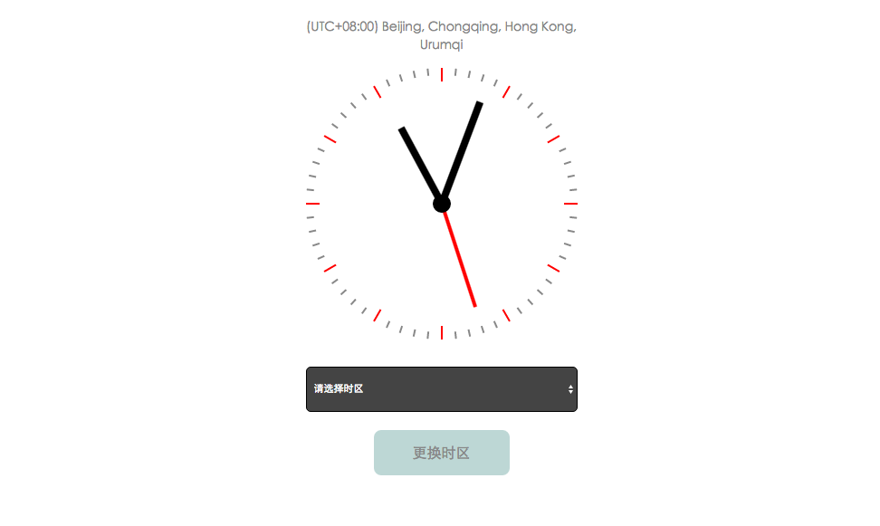

# js时钟组件



##如何使用

####引入clock.js

```html
    <script src="clock.js" type="text/javascript"></script>
```

####引入style.css

```html
    <link rel="stylesheet" type="text/css" href="style.css">
```

####基本结构

```html
<!doctype html>
<head>
    <link rel="stylesheet" type="text/css" href="style.css">
</head>
<body>
    <div id="body" class="theme1">
        <ul id="list"></ul>
        <div id="hour" class="hour"></div>
        <div id="min" class="min"></div>
        <div id="sec" class="sec"></div>
        <div id="center"></div>
    </div>

    <script src="clock.js" type="text/javascript"></script>
    <script>
    window.onload = function(){
        var c1 = new Clock();
        c1.init({
            hourColor: 'pink',
            minColor: 'pink',
            secColor: 'blue',
            offset: '8'
        });
        c1.getZone();
    }
  </script>
</body>
```

##文档

###参数

#####hourColor
时针颜色
#####minColor
分针颜色
#####secColor
秒针颜色
#####offset
当前时区

###方法
#####getZone()